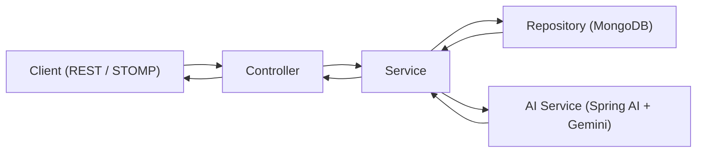

# `digital-twin-ai-backend`

Backend service for TwinAI — an AI-powered Digital Twin platform that builds a personalized profile from structured user inputs and uses that context to deliver more tailored conversational responses.

---

## Table of Contents

1. [Project Overview](#1-project-overview)
2. [Key Features](#2-key-features)
3. [Tech Stack](#3-tech-stack)
4. [Architecture / High-Level Design](#4-architecture--high-level-design)
5. [Main Functional Flows](#5-main-functional-flows)
6. [Module Breakdown](#6-module-breakdown)
7. [API Overview](#7-api-overview)
8. [Security](#8-security)
9. [Database Design](#9-database-design)
10. [AI Integration](#10-ai-integration)
11. [Validation and Error Handling](#11-validation-and-error-handling)
12. [Configuration and Environment Variables](#12-configuration-and-environment-variables)
13. [Getting Started / Local Setup](#13-getting-started--local-setup)
14. [Sample Request Flow](#14-sample-request-flow)
15. [Engineering Highlights](#15-engineering-highlights)
16. [Possible Improvements / Future Enhancements](#16-possible-improvements--future-enhancements)
17. [Author / Ownership](#17-author--ownership)

---

## 1. Project Overview

`digital-twin-ai-backend` is a Spring Boot service that powers an AI-driven Digital Twin experience. It handles user identity, profile generation, AI response streaming, chat history persistence, and account lifecycle operations through REST APIs and STOMP WebSocket messaging.

The core business problem this backend addresses is personalization at scale. Generic assistants often return broad, one-size-fits-all responses. This backend builds a user-specific profile from structured introspection questions and uses that stored context to generate more personalized conversations and guidance.

In this implementation, the Digital Twin is created in two stages. First, profile answers are converted into a profile summary using Google Gemini through Spring AI. Second, chat responses are generated and streamed using that stored summary as identity context. The backend also supports OTP-based account verification and password reset to enable realistic onboarding and recovery flows.

Primary users are end users interacting with their digital twin, along with developers or evaluators testing the API-first system. Major capabilities include authentication, profile lifecycle management, real-time AI chat streaming, chat and session history retrieval, password recovery, and account deletion.

---

## 2. Key Features

- User registration and login with JWT issuance
- Stateless JWT-based authentication for protected APIs
- Email OTP workflows for:
  - account verification in authenticated user flows
  - forgot-password verification in recovery flows
- Password reset support for:
  - forgot-password users through a reset-purpose token
  - authenticated users through current-password validation
- Profile question seeding from JSON at startup
- Digital twin profile generation from user answers using AI
- Profile retrieval and update with cache invalidation
- Real-time AI chat over WebSocket/STOMP with per-user event delivery
- Chat and session persistence in MongoDB
- Chat history APIs with pagination and session search
- Account deletion flow that removes chats, sessions, profiles, and user records
- Request validation and centralized exception response structure
- Resilience controls on the AI streaming path using rate limiting, bulkhead, circuit breaker, and timeout protections
- Actuator and Prometheus metrics exposure

---

## 3. Tech Stack

- Java 21
- Spring Boot 3.5.x
- Spring Web (REST)
- Spring WebSocket + STOMP + SockJS
- Spring Security
- Spring Data MongoDB
- Spring AI (`spring-ai-starter-model-google-genai`)
- Google Gemini (through Spring AI client)
- JWT (`io.jsonwebtoken` / JJWT)
- Jakarta Validation
- Spring Mail (SMTP)
- Caffeine Cache
- Resilience4j (circuit breaker, bulkhead, rate limiter, reactor integration)
- Spring Boot Actuator
- Micrometer Prometheus Registry
- Maven
- Lombok
- Docker (multi-stage image build)

---

## 4. Architecture / High-Level Design

The backend follows a layered architecture:

- **Controller Layer**: exposes REST and WebSocket message endpoints
- **Service Layer**: contains business logic for auth, OTP, profile generation, AI chat, session handling, and account operations
- **Repository Layer**: manages MongoDB access through Spring Data repositories
- **Model Layer**: stores MongoDB document models such as `User`, `TwinProfile`, `TwinChatSession`, `TwinChat`, `OtpToken`, and `ProfileQuestion`
- **DTO Layer**: defines request and response contracts for HTTP and WebSocket payloads
- **Security Layer**: provides JWT creation/validation, authentication filtering, user details loading, and security configuration
- **Configuration Layer**: handles CORS, WebSocket broker/auth interception, resilience wiring, and application properties

Typical request path:

1. Request enters a controller
2. Security filter chain validates JWT for protected routes
3. DTO validation is applied where `@Valid` and constraint annotations are used
4. Service layer executes business logic and calls repositories and/or the AI client
5. Response DTO or status is returned to the client



---

## 5. Main Functional Flows

### User Registration Flow

1. Client calls `POST /api/auth/register`
2. Backend checks whether the email already exists
3. Password is BCrypt-encoded
4. User is created with `isVerified=false`
5. JWT auth token is returned

### Login / JWT Authentication Flow

1. Client calls `POST /api/auth/login` with credentials
2. `AuthenticationManager` validates the credentials
3. Backend returns a JWT containing subject (`email`) and claims such as `username`, `verified`, and `purpose=AUTH`
4. For protected routes, `JwtAuthenticationFilter` resolves the user and sets the Spring Security context

### Email OTP Verification Flow

1. Authenticated user requests OTP via `POST /api/account/verify/send`
2. OTP is generated, hashed, stored in `otp_tokens`, and emailed
3. User submits OTP to `POST /api/account/verify/confirm`
4. If valid, the user is marked verified and a fresh JWT is issued

### Password Reset Flow

1. User requests OTP via `POST /api/password/change/forgot/mail/send`
2. OTP is validated through `POST /api/password/change/forgot/mail/verify`
3. Backend returns a short-lived JWT with `purpose=PASSWORD_RESET`
4. User resets password through `POST /api/password/change/forgot/reset` using the reset token in the `Authorization` header

### Protected API Access Flow

1. Client sends `Authorization: Bearer <token>`
2. Security filter validates the token and purpose (`AUTH`)
3. Protected controller and service methods use the authenticated principal email

### Profile Generation Flow

1. Client fetches profile questions via `GET /api/ai/profile-questions`
2. Client submits answers to `POST /api/ai/generate-profile`
3. Backend composes prompts from question prefixes and answers
4. AI service generates the profile summary
5. Summary and answers are persisted to `twin_profiles`, and cache is evicted

### AI Question/Answer Flow (WebSocket)

1. Client connects to `/ws` with JWT in the STOMP `Authorization` header
2. `StompAuthChannelInterceptor` authenticates `CONNECT` and stores auth in session
3. Client sends a question to `/app/twin.chat`
4. Backend resolves or creates a chat session, streams Gemini output as `DELTA` events, and then emits `DONE`
5. Final Q&A pairs are persisted to `twin_chats`

### Chat History Saving & Retrieval Flow

1. Session metadata is stored in `twin_chat_sessions` with title, counters, and timestamps
2. Messages are stored in `twin_chats`
3. Sessions can be listed using `GET /api/twin/chat/sessions` with optional title search
4. Session messages can be fetched using `GET /api/twin/chat/{sessionId}` with pagination
5. A session can be deleted using `DELETE /api/twin/chat/session/{sessionId}`

---

## 6. Module Breakdown

### Core Packages

- `com.digitaltwin.backend.controller` — REST and WebSocket entry points
- `com.digitaltwin.backend.service` — business logic for auth, OTP, profile, chat/session, account deletion, and AI interactions
- `com.digitaltwin.backend.repository` — MongoDB repositories and query methods
- `com.digitaltwin.backend.model` — MongoDB document models and enums
- `com.digitaltwin.backend.dto` — request/response contracts for HTTP and WebSocket
- `com.digitaltwin.backend.security` — JWT creation/validation, auth filter, user details service, security chain, and CORS
- `com.digitaltwin.backend.AIConfig` — WebSocket broker config, STOMP auth interceptor, resilience wrappers, and related wiring
- `com.digitaltwin.backend.exception` — global exception handling and structured error responses
- `com.digitaltwin.backend.bootstrap` — startup seeding of profile questions from JSON

### Notable Classes

- `SecurityConfig`, `JwtAuthenticationFilter`, `JwtService`
- `UserService`, `PasswordResetService`, `OtpService`, `EmailService`
- `TwinProfileService`, `TwinProfileCacheService`
- `TwinChatStreamingService`, `TwinChatService`, `TwinChatSessionService`
- `AIService`
- `StompAuthChannelInterceptor`, `WebSocketConfig`, `AiStreamGuard`
- `GlobalExceptionHandler`

---

## 7. API Overview

### Auth APIs

| Method | Path | Purpose | Auth Required |
|---|---|---|---|
| POST | `/api/auth/register` | Register user and return JWT | No |
| POST | `/api/auth/login` | Authenticate user and return JWT | No |

**Related DTOs**
- `UserRegistration`, `LoginRequest`, `JwtResponse`

### Account Verification APIs

| Method | Path | Purpose | Auth Required |
|---|---|---|---|
| POST | `/api/account/verify/send` | Send account verification OTP email | Yes |
| POST | `/api/account/verify/confirm` | Verify OTP and return refreshed JWT | Yes |

**Related DTOs**
- `OtpRequest.ConfirmOtpRequest`, `JwtResponse`

### Password Reset APIs

| Method | Path | Purpose | Auth Required |
|---|---|---|---|
| POST | `/api/password/change/forgot/mail/send` | Send forgot-password OTP | No |
| POST | `/api/password/change/forgot/mail/verify` | Verify forgot-password OTP and issue reset token | No |
| POST | `/api/password/change/forgot/reset` | Reset password using reset token | No (uses reset token in `Authorization` header) |
| PATCH | `/api/password/change/authenticated/reset` | Change password for logged-in user | Yes |

**Related DTOs**
- `OtpRequest.SendOtpRequest`, `OtpRequest.VerifyOtpRequest`
- `ResetPasswordRequest.ForgotPasswordRequest`
- `ResetPasswordRequest.AuthenticatedPasswordRequest`

### Profile APIs

| Method | Path | Purpose | Auth Required |
|---|---|---|---|
| GET | `/api/ai/profile-questions` | List profile questionnaire | Yes |
| POST | `/api/ai/generate-profile` | Generate and save profile summary from answers | Yes |
| POST | `/api/ai/update-profile` | Regenerate and update existing profile | Yes |
| GET | `/api/ai/get-profile` | Fetch stored profile answers and summary | Yes |

**Related DTOs**
- `TwinProfileRequest`, `TwinProfileResponse`

### Chat & History APIs

| Method | Path | Purpose | Auth Required |
|---|---|---|---|
| GET | `/api/twin/chat/sessions` | Get all sessions with optional search | Yes |
| GET | `/api/twin/chat/{sessionId}` | Get session message history (paginated) | Yes |
| DELETE | `/api/twin/chat/session/{sessionId}` | Delete one chat session and its messages | Yes |

**Related DTOs**
- `ChatSessionListItem`, `ChatHistoryResponse`, `TwinAnswerResponse`

### Account Deletion API

| Method | Path | Purpose | Auth Required |
|---|---|---|---|
| DELETE | `/api/account/delete` | Delete user account and associated data | Yes |

### WebSocket / STOMP APIs

| Type | Destination | Purpose | Auth Required |
|---|---|---|---|
| STOMP endpoint | `/ws` | SockJS/STOMP handshake | Connect with JWT header |
| Publish | `/app/twin.chat` | Send twin chat question | Yes |
| Publish | `/app/twin.cancel` | Cancel in-flight stream by message ID | Yes |
| Subscribe | `/user/queue/twin.events` | Receive stream events | Yes |

**Event Payload**
- `TwinWebSocketEvent` with types: `SESSION_CREATED`, `START`, `DELTA`, `DONE`, `ERROR`

---

## 8. Security

- Stateless security model with Spring Security
- CSRF disabled for token-based API usage
- JWT bearer token validation through a custom `OncePerRequestFilter`
- Passwords encoded with BCrypt
- Authenticated principal email used for ownership checks
- Session ownership checks enforced for chat history and delete operations
- Separate JWT purposes:
  - `AUTH` for normal authenticated access
  - `PASSWORD_RESET` for password recovery flow
- WebSocket STOMP authentication enforced by an inbound channel interceptor
- Public routes configured for:
  - `/api/auth/**`
  - `/api/password/change/forgot/**`
  - `/ws`
  - `/ws/**`

Verification state is tracked through `isVerified` and included in JWT claims. Client-side flows can use this state to gate user experience, and backend enforcement can be tightened further if required by product policy.

---

## 9. Database Design

MongoDB document storage is used throughout the application.

| Collection | Model | Purpose |
|---|---|---|
| `users` | `User` | Identity, credentials, and verification status |
| `otp_tokens` | `OtpToken` | OTP hash, purpose, expiry, and resend metadata |
| `profile_questions` | `ProfileQuestion` | Static questionnaire loaded from JSON |
| `twin_profiles` | `TwinProfile` | User answers and AI-generated profile summary |
| `twin_chat_sessions` | `TwinChatSession` | Chat session metadata such as title, counters, and timestamps |
| `twin_chats` | `TwinChat` | Persisted user question and AI response pairs |

Indexes described in the README:

- `otp_tokens`: unique compound index on `(email, purpose)`
- `twin_chat_sessions`: compound index on `(userId, updatedAt desc)`
- `twin_chats`: compound index on `(userId, sessionId, timestamp)`

---

## 10. AI Integration

The backend integrates with Gemini through Spring AI using `ChatClient`.

### Profile Generation

- **Input**: merged list of profile-question prefixes and user answers
- **Output**: generated profile summary string

### Twin Chat Response Streaming

- **Input**: stored profile summary plus the current user question
- **Output**: streamed text chunks (`Flux<String>`) sent to WebSocket clients

Prompt constants are centralized in `ConstantsTemplate`. The AI streaming path is wrapped with timeout, rate limiting, bulkhead, and circuit breaker protections using Resilience4j.

---

## 11. Validation and Error Handling

- DTO field validation uses Jakarta validation annotations such as `@NotBlank`, `@Email`, and `@Size`
- Path and query parameter validation is enabled in controllers through `@Validated`
- `GlobalExceptionHandler` returns a structured `ErrorResponse` containing:
  - `timestamp`
  - `status`
  - `error`
  - `message`
  - `path`
  - optional `fieldErrors`
- Dedicated handlers are present for:
  - `MethodArgumentNotValidException`
  - `ConstraintViolationException`
- A global fallback handler covers uncaught exceptions

---

## 12. Configuration and Environment Variables

### Required Runtime Configuration

| Key | Purpose | Example |
|---|---|---|
| `MONGODB_URI` | MongoDB connection string | `mongodb+srv://<user>:<pass>@<cluster>/<db>` |
| `JWT_SECRET` | JWT signing secret (HS256) | `<base64-or-strong-random-secret>` |
| `GEMINI_API_KEY` | Google Gemini API key | `<gemini-api-key>` |
| `SMTP_USERNAME` | SMTP sender username | `no-reply@example.com` |
| `SMTP_PASSWORD` | SMTP sender password or app password | `<smtp-password>` |
| `CORS_ALLOWED_ORIGINS` | Allowed frontend origins | `http://localhost:3000` |

### Important Application Properties

- AI model:
  - `spring.ai.google.genai.chat.options.model=gemini-2.5-flash-lite`
- JWT expirations:
  - `jwt.expiration-in-ms=86400000`
  - `jwt.password-reset-expiration-in-ms=600000`
- OTP:
  - `otp.expiry-minutes=5`
  - `otp.length=6`
  - `otp.resend-wait-seconds=300`
- Caching:
  - Caffeine cache `profileCache` with 30-minute expiry
- Resilience4j:
  - circuit breaker, bulkhead, and rate limiter on the AI path
- Actuator exposure:
  - `health,info,metrics,prometheus`

### Profile Notes

- `application.properties` sets `spring.profiles.active=local`
- `application-prod.properties` maps major secrets and runtime config to environment variables

---

## 13. Getting Started / Local Setup

### Prerequisites

- Java 21
- Maven 3.9+ (or use `./mvnw`)
- MongoDB (Atlas or local instance)
- Gemini API key
- SMTP account for OTP emails

### Clone and Enter Project

```bash
git clone <your-repo-url>
cd digital-twin-ai-backend
```

### Configure Environment / Properties

This backend requires values for MongoDB, JWT, Gemini, SMTP, and CORS.

You can provide them by:

- setting environment variables referenced by `application-prod.properties`, or
- defining equivalent keys for your local profile setup

Minimum keys to provide:

- `spring.data.mongodb.uri` or `MONGODB_URI`
- `jwt.secret` or `JWT_SECRET`
- `spring.ai.google.genai.api-key` or `GEMINI_API_KEY`
- `spring.mail.username` / `spring.mail.password` or `SMTP_USERNAME` / `SMTP_PASSWORD`
- `app.cors.allowed-origins` or `CORS_ALLOWED_ORIGINS`

### Run the Application

```bash
# Windows
.\mvnw spring-boot:run

# macOS/Linux
./mvnw spring-boot:run
```

Default server port: `8080`

### Build JAR

```bash
./mvnw clean package
```

### Run with Docker

```bash
docker build -t digital-twin-ai-backend .
docker run -p 8080:8080 \
  -e SPRING_PROFILES_ACTIVE=prod \
  -e MONGODB_URI="<...>" \
  -e JWT_SECRET="<...>" \
  -e GEMINI_API_KEY="<...>" \
  -e SMTP_USERNAME="<...>" \
  -e SMTP_PASSWORD="<...>" \
  -e CORS_ALLOWED_ORIGINS="http://localhost:3000" \
  digital-twin-ai-backend
```

### Docker Hub

Prebuilt Docker image for the backend is available on Docker Hub:

- Docker Hub: - [Backend Image on Docker Hub](https://hub.docker.com/repository/docker/chinmay189jain/digital-twin-ai-backend/general)

Pull the image:

```bash
docker pull chinmay189jain/digital-twin-ai-backend:latest
```

### API Documentation

Swagger / OpenAPI UI is **not currently implemented** in this backend.

### Quick Local Verification

1. Register or login using `/api/auth/*`
2. Request and confirm verification OTP via `/api/account/verify/*`
3. Generate a profile via `/api/ai/generate-profile`
4. Connect to WebSocket `/ws` and publish to `/app/twin.chat`
5. Retrieve history via `/api/twin/chat/*`

---

## 14. Sample Request Flow

### Flow A: New User to Verified Account

1. `POST /api/auth/register`
2. Receive auth JWT
3. `POST /api/account/verify/send` with authenticated access
4. `POST /api/account/verify/confirm` with OTP
5. Receive refreshed JWT with updated verification claim

### Flow B: Profile + Twin Chat

1. `GET /api/ai/profile-questions`
2. `POST /api/ai/generate-profile` with answer map
3. Connect STOMP over `/ws` with bearer token
4. Publish question to `/app/twin.chat`
5. Consume stream events from `/user/queue/twin.events`
6. Load persisted sessions and messages via `/api/twin/chat/sessions` and `/api/twin/chat/{sessionId}`

---

## 15. Engineering Highlights

This project is a strong backend portfolio piece because it demonstrates:

- secure API development with JWT and stateless Spring Security
- real-world identity workflows such as registration, login, verification OTP, and password reset
- layered architecture with clear separation of concerns
- MongoDB persistence design with purposeful indexing
- real-time AI streaming integration over WebSocket/STOMP
- resilience patterns around AI integration using circuit breaker, rate limiter, bulkhead, and timeout controls
- input validation and structured error responses
- basic caching and observability through Caffeine, Actuator, and Prometheus metrics

---

## 16. Possible Improvements / Future Enhancements

- Add comprehensive unit and integration tests beyond basic context-load coverage
- Add OpenAPI / Swagger documentation
- Add refresh tokens and a token revocation strategy
- Expand centralized exception handling for finer-grained HTTP status mapping
- Strengthen backend authorization checks around verification state if required by product policy
- Add CI/CD pipelines and quality gates for tests, linting, and security scanning
- Introduce structured audit logging for sensitive operations
- Externalize prompt templates and support prompt versioning
- Add a broker-backed WebSocket scaling strategy for multi-instance deployments

---

## 17. Author / Ownership

- **Author**: `CHINMAY JAIN`
- **Project**: `digital-twin-ai-backend`
- **Ownership**: Maintained by the project author and contributors in this repository
