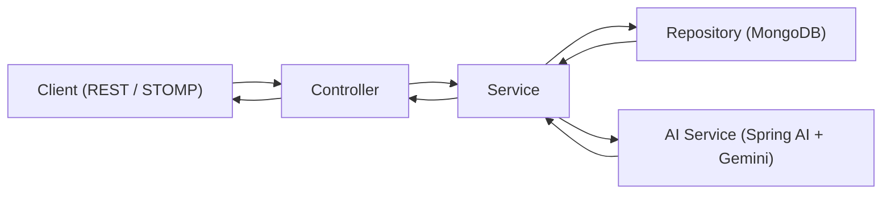

# 1. Project Title

`digital-twin-ai-backend`

---

# 2. Project Overview

`digital-twin-ai-backend` is a Spring Boot service that powers an AI-driven "Digital Twin" experience. It handles identity, profile generation, AI conversation streaming, chat history persistence, and account lifecycle operations through REST APIs and STOMP WebSocket messaging.

The core business problem this backend addresses is personalization at scale: users often get generic assistant responses, while this system builds a user-specific profile from structured introspection questions and uses that profile as context for future AI conversations. The result is a conversational assistant designed to reflect a user's stated personality, goals, and preferences.

In this implementation, a "Digital Twin AI" is generated in two stages: first, profile answers are converted into a profile summary using Google Gemini (via Spring AI); second, chat responses are streamed using that stored summary as identity context. The backend also manages OTP-based account verification and password reset to support real user onboarding and recovery flows.

Primary users are end users interacting with the twin, and developers/evaluators testing API-first workflows. Major capabilities include authentication, profile lifecycle management, real-time AI chat streaming, chat/session history retrieval, and account deletion.

---

# 3. Key Features

- User registration and login with JWT issuance.
- Stateless JWT-based authentication for protected APIs.
- Email OTP workflows:
- Account verification OTP (authenticated user flow).
- Password reset OTP (forgot-password flow).
- Password reset for:
- Forgot-password users (token-based reset).
- Authenticated users (current-password validation).
- Profile question seeding from JSON at startup.
- Digital twin profile generation using AI from user answers.
- Profile retrieval and update with cache invalidation.
- Real-time AI chat over WebSocket/STOMP with per-user event delivery.
- Chat and session persistence in MongoDB.
- Chat history APIs with pagination and session search.
- Account delete flow that removes chats, sessions, profiles, and user.
- Request validation and centralized exception response structure.
- Resilience controls on AI stream path (rate limiter, bulkhead, circuit breaker, timeout).
- Actuator + Prometheus metrics exposure.

---

# 4. Tech Stack

- Java 21
- Spring Boot 3.5.x
- Spring Web (REST)
- Spring WebSocket + STOMP + SockJS
- Spring Security
- Spring Data MongoDB
- Spring AI (`spring-ai-starter-model-google-genai`)
- Google Gemini (through Spring AI client)
- JWT (`io.jsonwebtoken` / JJWT)
- Spring Validation (Jakarta Validation)
- Spring Mail (SMTP)
- Caffeine Cache
- Resilience4j (circuit breaker, bulkhead, rate limiter, reactor integration)
- Spring Boot Actuator
- Micrometer Prometheus Registry
- Maven
- Lombok
- Docker (multi-stage image build)

---

# 5. Architecture / High-Level Design

The backend follows a layered architecture:

- **Controller Layer**: Exposes REST and WebSocket message endpoints.
- **Service Layer**: Encapsulates business logic (auth, OTP, profile, AI chat, account operations).
- **Repository Layer**: MongoDB data access via Spring Data repositories.
- **Model Layer**: MongoDB document models (`User`, `TwinProfile`, `TwinChatSession`, `TwinChat`, `OtpToken`, `ProfileQuestion`).
- **DTO Layer**: API contracts for requests/responses and WebSocket event payloads.
- **Security Layer**: JWT service, authentication filter, user details service, and security configuration.
- **Configuration Layer**: CORS, WebSocket broker/auth interception, resilience wiring, app properties.

Typical request path:
1. Request enters controller.
2. Security filter chain validates JWT (for protected routes).
3. DTO validation is applied where `@Valid`/constraint annotations are used.
4. Service executes business logic and calls repositories and/or AI client.
5. Response DTO or status is returned.



---

# 6. Main Functional Flows

## User Registration Flow

1. Client calls `POST /api/auth/register`.
2. Backend checks existing email.
3. Password is BCrypt-encoded.
4. User is created with `isVerified=false`.
5. JWT auth token is returned.

## Login / JWT Authentication Flow

1. Client calls `POST /api/auth/login` with credentials.
2. `AuthenticationManager` validates credentials.
3. Backend returns JWT containing subject (email) and claims (`username`, `verified`, `purpose=AUTH`).
4. For protected routes, `JwtAuthenticationFilter` resolves user and sets Spring Security context.

## Email OTP Verification Flow (Account Verification)

1. Authenticated user requests OTP via `POST /api/account/verify/send`.
2. OTP is generated, hashed, stored in `otp_tokens`, and emailed.
3. User submits OTP to `POST /api/account/verify/confirm`.
4. If valid, user is marked verified and a fresh JWT is issued.

## Password Reset Flow (Forgot Password)

1. User requests OTP via `POST /api/password/change/forgot/mail/send`.
2. OTP is validated via `POST /api/password/change/forgot/mail/verify`.
3. Backend returns a short-lived JWT with `purpose=PASSWORD_RESET`.
4. User resets password via `POST /api/password/change/forgot/reset` with reset token in `Authorization`.

## Protected API Access Flow

1. Client sends `Authorization: Bearer <token>`.
2. Security filter validates token and purpose (`AUTH`).
3. Protected controller/service methods use authenticated principal email.

## Profile Generation Flow

1. Client fetches profile questions via `GET /api/ai/profile-questions`.
2. Client submits answers to `POST /api/ai/generate-profile`.
3. Backend composes prompts from question prefixes + answers.
4. AI service generates profile summary.
5. Summary and answers are persisted to `twin_profiles` and cache is evicted.

## AI Question/Answer Flow (WebSocket)

1. Client connects to `/ws` with JWT in STOMP `Authorization` header.
2. `StompAuthChannelInterceptor` authenticates CONNECT and stores auth in session.
3. Client sends question to `/app/twin.chat`.
4. Backend resolves/creates chat session, streams Gemini output as `DELTA` events, then emits `DONE`.
5. Final Q&A pair is persisted to `twin_chats`.

## Chat History Saving & Retrieval Flow

1. Session metadata stored in `twin_chat_sessions` (title/message count/timestamps).
2. Messages stored in `twin_chats`.
3. Sessions list: `GET /api/twin/chat/sessions` (optional title search).
4. Session messages: `GET /api/twin/chat/{sessionId}` (paginated).
5. Session delete: `DELETE /api/twin/chat/session/{sessionId}`.

---

# 7. Module Breakdown

## Core Packages

- `com.digitaltwin.backend.controller`
- REST and WebSocket entry points.
- `com.digitaltwin.backend.service`
- Business logic for auth, OTP, profile, chat/session, account deletion, and AI interactions.
- `com.digitaltwin.backend.repository`
- MongoDB repositories and query methods.
- `com.digitaltwin.backend.model`
- MongoDB document models and enums.
- `com.digitaltwin.backend.dto`
- Request/response contracts for HTTP and WebSocket.
- `com.digitaltwin.backend.security`
- JWT creation/validation, auth filter, user details service, security chain, CORS.
- `com.digitaltwin.backend.AIConfig`
- WebSocket broker config, STOMP auth interceptor, resilience wrappers/mappers.
- `com.digitaltwin.backend.exception`
- Global exception handler with structured error response.
- `com.digitaltwin.backend.bootstrap`
- Startup seeding of profile questions from JSON.

## Notable Classes

- `SecurityConfig`, `JwtAuthenticationFilter`, `JwtService`
- `UserService`, `PasswordResetService`, `OtpService`, `EmailService`
- `TwinProfileService`, `TwinProfileCacheService`
- `TwinChatStreamingService`, `TwinChatService`, `TwinChatSessionService`
- `AIService`
- `StompAuthChannelInterceptor`, `WebSocketConfig`, `AiStreamGuard`
- `GlobalExceptionHandler`

---

# 8. API Overview

## Auth APIs

| Method | Path | Purpose | Auth Required |
|---|---|---|---|
| POST | `/api/auth/register` | Register user and return JWT | No |
| POST | `/api/auth/login` | Authenticate user and return JWT | No |

### Related DTOs
- `UserRegistration`, `LoginRequest`, `JwtResponse`

## Account Verification APIs

| Method | Path | Purpose | Auth Required |
|---|---|---|---|
| POST | `/api/account/verify/send` | Send account verification OTP email | Yes |
| POST | `/api/account/verify/confirm` | Verify OTP and return refreshed JWT | Yes |

### Related DTOs
- `OtpRequest.ConfirmOtpRequest`, `JwtResponse`

## Password Reset APIs

| Method | Path | Purpose | Auth Required |
|---|---|---|---|
| POST | `/api/password/change/forgot/mail/send` | Send forgot-password OTP | No |
| POST | `/api/password/change/forgot/mail/verify` | Verify forgot-password OTP and issue reset token | No |
| POST | `/api/password/change/forgot/reset` | Reset password using reset token | No (reset token in header) |
| PATCH | `/api/password/change/authenticated/reset` | Change password for logged-in user | Yes |

### Related DTOs
- `OtpRequest.SendOtpRequest`, `OtpRequest.VerifyOtpRequest`
- `ResetPasswordRequest.ForgotPasswordRequest`
- `ResetPasswordRequest.AuthenticatedPasswordRequest`

## Profile APIs

| Method | Path | Purpose | Auth Required |
|---|---|---|---|
| GET | `/api/ai/profile-questions` | List profile questionnaire | Yes |
| POST | `/api/ai/generate-profile` | Generate and save profile summary from answers | Yes |
| POST | `/api/ai/update-profile` | Regenerate and update existing profile | Yes |
| GET | `/api/ai/get-profile` | Fetch stored profile answers + summary | Yes |

### Related DTOs
- `TwinProfileRequest`, `TwinProfileResponse`

## Chat & History APIs

| Method | Path | Purpose | Auth Required |
|---|---|---|---|
| GET | `/api/twin/chat/sessions` | Get all sessions, optional search | Yes |
| GET | `/api/twin/chat/{sessionId}` | Get session message history (paginated) | Yes |
| DELETE | `/api/twin/chat/session/{sessionId}` | Delete one chat session and its messages | Yes |

### Related DTOs
- `ChatSessionListItem`, `ChatHistoryResponse`, `TwinAnswerResponse`

## Account Deletion API

| Method | Path | Purpose | Auth Required |
|---|---|---|---|
| DELETE | `/api/account/delete` | Delete user account and associated data | Yes |

## WebSocket/STOMP APIs

| Type | Destination | Purpose | Auth Required |
|---|---|---|---|
| STOMP endpoint | `/ws` | SockJS/STOMP handshake | Connect with JWT header |
| Publish | `/app/twin.chat` | Send twin chat question | Yes |
| Publish | `/app/twin.cancel` | Cancel in-flight stream by message id | Yes |
| Subscribe | `/user/queue/twin.events` | Receive stream events | Yes |

### Event Payload
- `TwinWebSocketEvent` with types: `SESSION_CREATED`, `START`, `DELTA`, `DONE`, `ERROR`

---

# 9. Security

- Stateless security model with Spring Security.
- CSRF disabled for API token-based usage.
- JWT bearer token validation in custom `OncePerRequestFilter`.
- Passwords encoded with BCrypt.
- Authenticated principal email used for ownership checks.
- Session ownership checks enforced for chat history/delete operations.
- Separate JWT purposes:
- `AUTH` for normal authenticated access.
- `PASSWORD_RESET` for reset flow.
- WebSocket STOMP authentication enforced by inbound channel interceptor.
- Public routes configured for:
- `/api/auth/**`
- `/api/password/change/forgot/**`
- `/ws`, `/ws/**`

Note: User verification state is tracked (`isVerified`) and included in JWT claims; frontend currently enforces verified-user routing before protected UI access.

---

# 10. Database Design

MongoDB documents are used (no relational schema).

| Collection | Model | Purpose |
|---|---|---|
| `users` | `User` | Identity, credentials (hashed), verification status |
| `otp_tokens` | `OtpToken` | OTP hash + purpose + expiry/resend metadata |
| `profile_questions` | `ProfileQuestion` | Static questionnaire loaded from JSON |
| `twin_profiles` | `TwinProfile` | User answers + AI-generated profile summary |
| `twin_chat_sessions` | `TwinChatSession` | Chat session metadata (title, counters, timestamps) |
| `twin_chats` | `TwinChat` | Persisted user question + AI response pairs |

Indexing present in code:
- `otp_tokens`: unique compound index on `(email, purpose)`
- `twin_chat_sessions`: compound index on `(userId, updatedAt desc)`
- `twin_chats`: compound index on `(userId, sessionId, timestamp)`

---

# 11. AI Integration

The backend integrates Gemini through Spring AI (`ChatClient`).

- **Profile generation**:
- Input: merged list of profile-question prefixes and user answers.
- Output: generated profile summary string.
- **Twin chat response streaming**:
- Input: stored profile summary + current user question.
- Output: streamed text chunks (`Flux<String>`) sent to WebSocket clients.

Prompt constants are centralized in `ConstantsTemplate`. AI streaming is wrapped with timeout + rate limiting + bulkhead + circuit breaker protections using Resilience4j.

---

# 12. Validation and Error Handling

- DTO field validation uses Jakarta validation annotations (`@NotBlank`, `@Email`, `@Size`, etc.).
- Path/query parameter validation is enabled in controllers using `@Validated`.
- `GlobalExceptionHandler` returns a structured `ErrorResponse`:
- `timestamp`, `status`, `error`, `message`, `path`, optional `fieldErrors`.
- Dedicated handlers exist for:
- `MethodArgumentNotValidException`
- `ConstraintViolationException`
- A global fallback handler covers other exceptions.

---

# 13. Configuration and Environment Variables

## Required Runtime Configuration

| Key | Purpose | Example |
|---|---|---|
| `MONGODB_URI` | MongoDB connection string | `mongodb+srv://<user>:<pass>@<cluster>/<db>` |
| `JWT_SECRET` | JWT signing secret (HS256) | `<base64-or-strong-random-secret>` |
| `GEMINI_API_KEY` | Google Gemini API key | `<gemini-api-key>` |
| `SMTP_USERNAME` | SMTP sender username | `no-reply@example.com` |
| `SMTP_PASSWORD` | SMTP sender password/app-password | `<smtp-password>` |
| `CORS_ALLOWED_ORIGINS` | Allowed frontend origins | `http://localhost:3000` |

## Important Application Properties (currently implemented)

- AI model: `spring.ai.google.genai.chat.options.model=gemini-2.5-flash-lite`
- JWT expirations:
- `jwt.expiration-in-ms=86400000`
- `jwt.password-reset-expiration-in-ms=600000`
- OTP:
- `otp.expiry-minutes=5`
- `otp.length=6`
- `otp.resend-wait-seconds=300`
- Caching:
- Caffeine cache `profileCache` with 30-minute expiry
- Resilience4j:
- Circuit breaker, bulkhead, rate limiter for AI path
- Actuator:
- `health,info,metrics,prometheus`

Profile notes:
- `application.properties` sets `spring.profiles.active=local`.
- `application-prod.properties` maps major secrets/configs to environment variables.

---

# 14. Getting Started / Local Setup

## Prerequisites

- Java 21
- Maven 3.9+ (or use `./mvnw`)
- MongoDB (Atlas or local instance)
- Gemini API key
- SMTP account (for OTP emails)

## Clone and Enter Project

```bash
git clone <your-repo-url>
cd digital-twin-ai-backend
```

## Configure Environment / Properties

This backend requires values for MongoDB, JWT, Gemini, SMTP, and CORS.

You can provide them by:
- setting environment variables referenced by `application-prod.properties`, or
- defining equivalent keys for your local profile setup.

Minimum keys to provide:
- `spring.data.mongodb.uri` or `MONGODB_URI`
- `jwt.secret` or `JWT_SECRET`
- `spring.ai.google.genai.api-key` or `GEMINI_API_KEY`
- `spring.mail.username` / `spring.mail.password` or `SMTP_USERNAME` / `SMTP_PASSWORD`
- `app.cors.allowed-origins` or `CORS_ALLOWED_ORIGINS`

## Run the Application

```bash
# Windows
.\mvnw spring-boot:run

# macOS/Linux
./mvnw spring-boot:run
```

Default server port: `8080`

## Build JAR

```bash
./mvnw clean package
```

## Run with Docker

```bash
docker build -t digital-twin-ai-backend .
docker run -p 8080:8080 \
  -e SPRING_PROFILES_ACTIVE=prod \
  -e MONGODB_URI="<...>" \
  -e JWT_SECRET="<...>" \
  -e GEMINI_API_KEY="<...>" \
  -e SMTP_USERNAME="<...>" \
  -e SMTP_PASSWORD="<...>" \
  -e CORS_ALLOWED_ORIGINS="http://localhost:3000" \
  digital-twin-ai-backend
```

## API Documentation

Swagger/OpenAPI UI is **not currently implemented** in this backend.

## Quick Local Verification

1. Register/login using `/api/auth/*`.
2. Request and confirm verification OTP via `/api/account/verify/*`.
3. Generate profile via `/api/ai/generate-profile`.
4. Connect WebSocket `/ws` and send `/app/twin.chat`.
5. Retrieve history via `/api/twin/chat/*`.

---

# 15. Sample Request Flow

## Flow A: New User to Verified Account

1. `POST /api/auth/register`
2. Receive auth JWT.
3. `POST /api/account/verify/send` (authenticated)
4. `POST /api/account/verify/confirm` with OTP
5. Receive refreshed JWT with updated verification claim.

## Flow B: Profile + Twin Chat

1. `GET /api/ai/profile-questions`
2. `POST /api/ai/generate-profile` with answer map
3. Connect STOMP over `/ws` with bearer token
4. Publish question to `/app/twin.chat`
5. Consume stream events from `/user/queue/twin.events`
6. Load persisted sessions/messages via `/api/twin/chat/sessions` and `/api/twin/chat/{sessionId}`

---

# 16. Engineering Highlights

This project is a strong backend engineering portfolio piece because it demonstrates:

- Secure API development with JWT and stateless Spring Security.
- Real-world identity workflows (registration, login, verification OTP, password reset).
- Layered architecture with clear separation of concerns.
- Persistence design in MongoDB with purposeful indexing.
- Real-time AI streaming integration over WebSocket/STOMP.
- AI resilience patterns using circuit breaker, rate limiter, bulkhead, and timeout.
- Input validation and structured error responses.
- Caching + observability primitives (Actuator + Prometheus metrics).

---

# 17. Possible Improvements / Future Enhancements

- Add comprehensive unit/integration tests beyond context-load test.
- Add OpenAPI/Swagger documentation.
- Add refresh token + token revocation strategy.
- Expand centralized exception handling for finer-grained HTTP status mapping.
- Strengthen authorization checks around verification state on backend endpoints (if required by product policy).
- Add CI/CD pipeline and quality gates (tests, linting, dependency/security scanning).
- Introduce structured audit logging for sensitive operations.
- Externalize prompt templates and add prompt/version management.
- Add broker-backed WebSocket scaling strategy for multi-instance deployments.

---

# 18. Author / Ownership

- **Author**: `<Your Name>`
- **Project**: `digital-twin-ai-backend`
- **Ownership**: Maintained by the project author/contributors in this repository.

